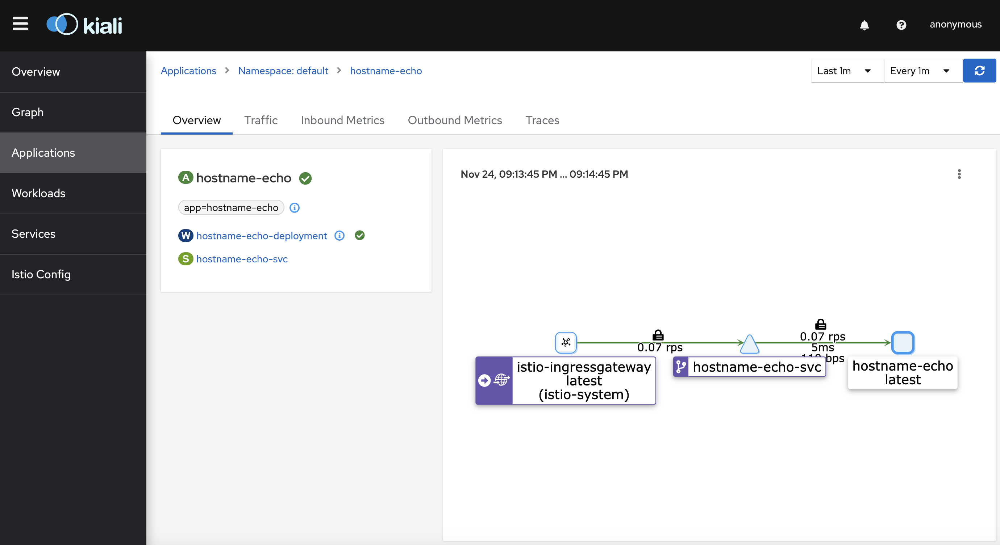

We are going to use Istio as a service mesh for our Kubernetes Cluster and Octavia Load Balancer as ingress gateway for mesh.

### Prequiresitions:
- Kubernetes Cluster deployed with Ansible ([article](https://dragomiralin.ro/deploy-kubernetes-on-openstack))
- OpenStack Cloud Controller Manager
- OpenStack Octavia Enabled

## 1. Istio
Istio is a service mesh tool that provides observability, security in depth and traffic management.

### Traffic Management
We can direct traffic within our mesh. Traffic management is based on Envoy proxies that are deployed along with services.

API Resource:
- **Virtual Service** -> route requests to a service in different ways
- **Gateway** -> manage inbound and outbound traffic for your mesh (ingress/egress traffic)
- **Destination Rules** -> are applied after virtual service as destionation rules such as traffic policy(load balancing mode), tls security mode, circuit breaker and so on
- **Service entry** -> redirect and forward traffic, apply retry, timeout for external destinations
  
### Security
Istio security features provide **strong identity**, **powerful policy**, **TLS encryption** and **authntication**, **authorization** and **audit(AAA)** tools to protect your services and data.

### Observability
Istio provides us the following types of telemetry:
- **Metrics** -> latency, traffic, errors and saturation
- **Distributed Traces** -> distributed trace spans for each service
- **Access Logs** -> full record of each request

## 2. Octavia Load Balancer
Octavia is an open source, operator-scale load balancing solution designed to work with OpenStack.


### Setup Octavia Load Balancer with Ansible

```bash
$ vi inventory/$CLUSTER/group_vars/all/openstack.yml
```
```yaml
## Override default LBaaS behavior
openstack_lbaas_use_octavia: True
openstack_lbaas_method: "ROUND_ROBIN"
openstack_lbaas_provider: "amphora" # or `octavia` depends on your provider configuration
openstack_lbaas_create_monitor: "yes"
openstack_lbaas_monitor_delay: "1m"
openstack_lbaas_monitor_timeout: "30s"
openstack_lbaas_monitor_max_retries: "3"

## Values for the external OpenStack Cloud Controller
external_openstack_lbaas_network_id: "<network_id>" # your internal cluster network
external_openstack_lbaas_subnet_id: "<subnet_id>" # a subnet from your internal cluster network
external_openstack_lbaas_floating_network_id: "<floating_network_id>" # it's usually the same as `public` network
external_openstack_lbaas_floating_subnet_id: "<floating_subnet_id>" # subnet from 
external_openstack_lbaas_method: "ROUND_ROBIN"
external_openstack_lbaas_provider: "amphora"
external_openstack_lbaas_create_monitor: false
external_openstack_lbaas_monitor_delay: "1m"
external_openstack_lbaas_monitor_timeout: "30s"
external_openstack_lbaas_monitor_max_retries: "3"
external_openstack_lbaas_manage_security_groups: false
external_openstack_lbaas_internal_lb: false
external_openstack_network_ipv6_disabled: false
external_openstack_network_internal_networks:
   - "<internal_cluster_network_name>"

external_openstack_application_credential_name: <credential_name>
external_openstack_application_credential_id:  <credential_id>
external_openstack_application_credential_secret: <credential_secret>
## The tag of the external OpenStack Cloud Controller image
external_openstack_cloud_controller_image_tag: "v1.23.3" 
```

Run 
```bash
$ ansible-playbook --become -i inventory/$CLUSTER/hosts cluster.yml
```

Check if OpenStack cloud controller manager is working
```bash
$ kubectl -n kube-system get pods | grep "openstack"
```
```bash
NAME                                                   READY   STATUS    RESTARTS        AGE
openstack-cloud-controller-manager-k6945               1/1     Running   0               5m
```
## 3. Install Istio
Instructions for installing Istio control plane on Kubernetes can be found [here](https://istio.io/latest/docs/setup/)

Get Istio 
```bash
$ curl -L https://istio.io/downloadIstio | sh -
```

Move to Istio directory
```bash
$ cd <istio-directory>
```

Install Istio client
```bash
$ brew install istioctl
# or (istioctl client binary in the bin/ directory)
$ export PATH=$PWD/bin:$PATH 
```

#### Install Istio
We use demo configuration profile. There are 6 profiles: default, demo, minimal, remote, empty and preview. ([Installation Configuration Profiles](https://istio.io/latest/docs/setup/additional-setup/config-profiles/))

```bash
$ istioctl install --set profile=demo -y
```
```bash
✔ Istio core installed                
✔ Istiod installed                      
✔ Egress gateways installed               
✔ Ingress gateways installed
✔ Installation complete    
Making this installation the default for injection and validation.
```

Inject Envoy sidecar proxies into `default` namespace:
```
$ kubectl label namespace default istio-injection=enabled
```

### Deploy test application
```bash
$ kubectl apply -f deployment.yaml
```
`deployment.yaml`
```yaml
apiVersion: apps/v1
kind: Deployment
metadata:
  name: hostname-echo-deployment
spec:
  replicas: 1
  selector:
    matchLabels:
      app: hostname-echo
  template:
    metadata:
      labels:
        app: hostname-echo
    spec:
      containers:
        - image: "lingxiankong/alpine-test"
          imagePullPolicy: Always
          name: hostname-echo-container
          ports:
            - containerPort: 8080
---
apiVersion: v1
kind: ClusterIP
metadata:
  name: hostname-echo-svc
spec:
  ports:
     -  port: 8080
        protocol: TCP
        targetPort: 8080
  selector:
    app: hostname-echo
  type: LoadBalancer

```

The test application is deployed but we can not access it from outside. To make it accessible, we need to create an Istio Ingress Gateway
### Deploy Gateway and Virtual Service
```bash
$ kubectl apply -f gateway.yaml
```
`gateway.yaml`
```yaml 
apiVersion: networking.istio.io/v1alpha3
kind: Gateway
metadata:
  name: hostname-echo-gateway
spec:
  selector:
    istio: ingressgateway
  servers:
  - port:
      number: 80
      name: http
      protocol: HTTP
    hosts:
    - "*"
---
apiVersion: networking.istio.io/v1alpha3
kind: VirtualService
metadata:
  name: hostname-echo
spec:
  hosts:
  - "*"
  gateways:
  - hostname-echo-gateway
  http:
  - match:
    - uri:
        exact: /
    route:
    - destination:
        host: hostname-echo-svc
        port:
          number: 8080
```

Ensure that there are no issues with the configuration:
```bash
$ istioctl analyze

✔ No validation issues found when analyzing namespace: default.
```

#### Get Istio Ingress IP
```bash
$ kubectl get svc istio-ingressgateway -n istio-system
```
Run the following command to retrieve the gateway ip
```bash
```bash
$ export GATEWAY_IP=$(kubectl -n istio-system get service istio-ingressgateway -o jsonpath='{.status.loadBalancer.ingress[0].ip}') 
```

#### Verify external access
Test connectivity

```bash
$ echo http://$GATEWAY_IP
```
```
hostname-echo-deployment-7d5d9dfcc8-n9sc4
```

### View dashboard
Kiali Dashboard is an observability console for Istio with service mesh configuration and validation capabilities

```bash
$ kubectl apply -f samples/addons
$ kubectl rollout status deployment/kiali -n istio-system
```

Access the Kiali dashboard
```bash
$ istioctl dashboard kiali
```

