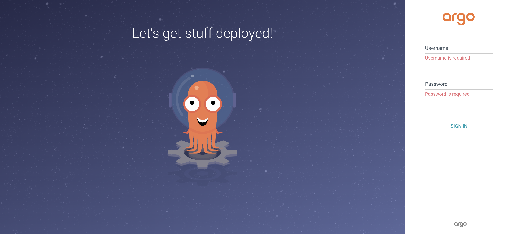
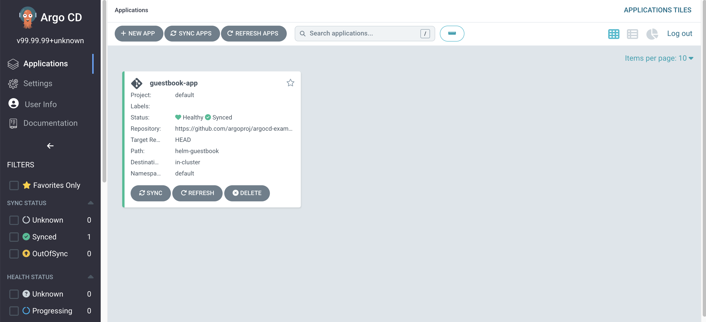
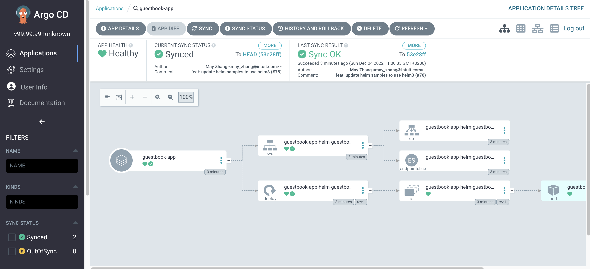

Argo CD is a continuous delivery tool for Kubernetes. It allows developers to define their application deployment infrastructure as code, and then uses that code to automate the deployment of applications to multiple Kubernetes clusters.

Some of the key features of Argo CD include:
- Declarative, GitOps-based deployment: Argo CD uses a declarative configuration model to define the desired state of an application deployment in Git. 
- Automated deployment and synchronization: Argo CD automatically deploys and updates applications in Kubernetes based on the configuration defined in Git.
- Role-based access control: Argo CD includes built-in support for role-based access control (RBAC)
- Support for multiple clusters and namespaces: Argo CD can manage applications across multiple Kubernetes clusters and namespaces
- Scalable and highly available architecture: Argo CD is designed to be scalable and highly available


### ArgoCD Installation
To install Argo CD, you will first need to have a Kubernetes cluster up and running.

Create `argocd` namespace:
```bash
$ kubectl create namespace argocd
```

Add the Argo CD Helm repository to your local Helm configuration using the following command:
```bash
$ helm repo add bitnami https://charts.bitnami.com/bitnami
```

Update your local Helm repository index to include the latest Argo CD charts:
```bash
$ helm repo update
```

Install Argo CD:
```bash
$ helm upgrade --install argocd bitnami/argo-cd -n argocd
```

Let's see the deployment
```bash
$ kubectl get pods -n argocd
NAME                                            READY   STATUS    RESTARTS   AGE
argocd-argo-cd-app-controller-98547745f-2kgdk   2/2     Running   0          4m
argocd-argo-cd-repo-server-677655b8f-hq8gn      2/2     Running   0          4m
argocd-argo-cd-server-74ffc75b95-lnpm6          2/2     Running   0          4m
argocd-redis-master-0                           2/2     Running   0          4m
```

To expose Argo CD on Kubernetes we will use `kubectl port-forward`:
```bash
$ kubectl port-forward service/argocd-argo-cd-server 8888:http
```

Access Argo CD Dashboard: `http://localhost:8888`


Username: `admin`
For getting the password run:
```bash
$ echo "Password: $(kubectl -n argocd get secret argocd-secret -o jsonpath="{.data.clearPassword}" | base64 -d)"
```
### Create Argo CD Application with Helm Charts
As a demo application we will use an application provided by Argo CD

Go to `NEW APP` then `EDIT AS YAML` to insert the Argo CD Application
```yaml
apiVersion: argoproj.io/v1alpha1
kind: Application
metadata:
  name: guestbook-app
spec:
  destination:
    name: ''
    namespace: default
    server: 'https://kubernetes.default.svc'
  source:
    path: helm-guestbook
    repoURL: 'https://github.com/argoproj/argocd-example-apps'
    targetRevision: HEAD
    helm:
      valueFiles:
        - values.yaml
  project: default
  syncPolicy:
    automated:
      prune: false
      selfHeal: false
```



See the deployment on kubernetes:
```bash
$ kubectl get pods -n default
NAME                                           READY   STATUS    RESTARTS   AGE
guestbook-app-helm-guestbook-87646d7f7-lrjgd   2/2     Running   0          3m45s
```

In summary, to set up continuous deployment with Argo CD, you need to:

- Create an application in Argo CD that is connected to your Git repository.
- Specify the deployment strategy and other details, such as the target namespace and the target cluster.
- Configure Argo CD to automatically sync with the Git repository on a regular basis.
- With these steps in place, Argo CD will automatically deploy changes to your application whenever they are pushed to the Git repository.
