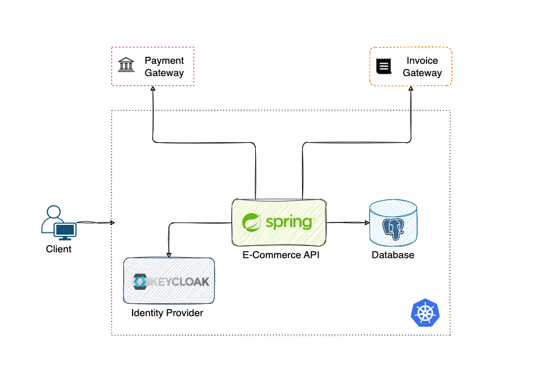
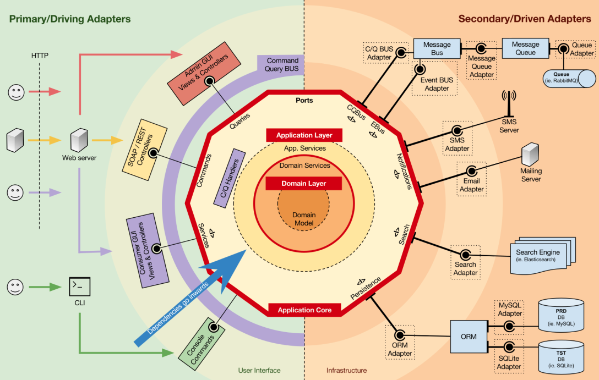

Another E-Commerce project used to learn and practice a wide range of best practices and tools.

Building this E-Commerce platform and digging into software architecture has been an incredibly exciting journey for me. For someone who finds joy in crafting software, this project has been like a playground where I get to explore and face challenges head-on.

Discovering the ins and outs of Hexagonal Architecture, or the "Ports and Adapters Pattern," has been a real eye-opener. The idea of keeping things neat and organized while following domain-driven design principles has not only made the codebase more manageable but has also brought a sense of clarity to the entire project structure.

## Project Overview
### Project Structure
The project follows a modular structure, emphasizing the separation of concerns. The high-level architecture consists of the following services:

The provided services are:

- **User service**: handles the user's data and billing information 
- **Product service**: handles the products catalog(create, delete, update, retrieve)
- **Shopping cart service**: handles the user's shopping cart(persist the items, update, delete, checkout)
- **Order service**: handles the user's orders(create order from shopping cart, update, delete, retrieve)
- **Payment service**: handles the orders' payments using external services(Stripe, PayPal, BTPay)
- **Category service**: handles the products categories(relation between products and categories)
- **Notification service**: send notifications to customers via Email
- **Storage service**: storage service for storing invoices, emails (S3 backend storage)

### Technologies Used
The project leverages a modern technology stack, including:

- **Java 17**: The latest version of Java.
- **Spring Boot, Spring Data JPA, Redis, Spring Security, Spring Cloud**: Core components for building robust and scalable applications.
- **MapStruct, Lombok, Swagger 3, Micrometer**: Tools and libraries to enhance development productivity.
- **Maven multi-module**: Organizes the project into manageable modules.
- **JUnit 5, Mockito, TestContainers**: Ensures robust testing of the application.
- **PostgreSQL, Redis**: Databases for storing data.
- **Kubernetes, ArgoCD, Helm Charts, Istio**: Deployment and orchestration tools for managing microservices.
- **Prometheus, Grafana**: Monitoring tools for observing the health and performance of the application.
- **GitHub Actions, SonarQube, SonarCloud**: CI/CD and code quality tools for maintaining high standards.
- **Terraform**: Infrastructure provisioning tool such creating S3 buckets and so on.

### Project Planning
The project is planned in two phases:

1. **Phase 1 (Current)**: Create a Monolithic Application
Implement a monolithic application with Hexagonal Architecture.

2. **Phase 2: Split into Microservices**
Fork the repository and split the monolith into microservices while retaining the advantages of Hexagonal Architecture.

### Architecture
A monolithic application with Hexagonal Architecture.

- Backend: I use Spring Boot which is a Java framework that makes it easy to create Spring-based applications. It provides a wide range of features, including automatic configuration, dependency injection, and embedded web servers.

- Identity and Access Management: Keycloak is an open source identity and access management (IAM) solution. It provides a variety of features, including user authentication, authorization, and single sign-on (SSO).

- Database: PostgreSQL is an open source relational database management system (RDBMS) that provides a wide range of features. It is a popular choice for many applications due to its reliability, performance, and scalability.

The following is a high-level overview of how the architecture looks like:

1. The client sends a request to the E-Commerce API.
2. The E-Commerce API authenticates the client using Keycloak.
3. The E-Commerce API use external Payment Gateway to process the payments.
4. The E-Commerce API use external Invoice Gateway to generate invoices.
5. The E-Commerce API use Postgres to store the data.

I'm going to document all the steps of developing this application.
1. Architecture/Design
2. Tools and Dependencies
3. Best Practices / Design Patterns / Approaches
4. Data Model
5. Development

### Hexagonal Architecture
The project adopts the Hexagonal Architecture, also known as the "Ports and Adapters Pattern." This architecture ensures a clean separation of concerns, with the domain model communicating with the external world using interfaces as ports. External modules communicate with the domain through adapters.

**Hexagonal Architecture**, also known as “Ports and Adapters Pattern”, is an architectural pattern exposed by Alistair Cockburn which applies the Anti-corruption Layer DDD Pattern in a very effective way. The concept is very simple: the domain model communicates with the external world using interfaces as ports. Every external module that wants to communicate with the domain builds an adapter and attaches it to the port.

I chose Hexagonal Architecture because it provides a loose coupling between components and a high-level of abstraction.

The Hexagonal Architecture, also referred to as Ports and Adapters.
The input goes through at a Port via an Adapter and the output is sent from the application through a Port to an Adapter.

### Port
A port is an entry point which determines the interface with which other components will interact.

**tips:**
- a Port should always have 2 items hooked to it, one being always a test

### Adapter
An adapter initiates the interaction with application through a port.

The Hexagonal Architecture advantages:
1. Swapping data sources (e.g. JSON API, GraphQL, etc.)
2. Changing technology with a lower impact
3. Test business logic in isolation from external systems

### Dependency Management
There are 2 ways to manage dependencies:
- Multi-module projects, where each module has its own dependencies and JAR(maven multi-module)
- Single module project, enforcing the dependency constraints through architectural unit tests.

I'm going to use the **Multi-module project** approach.

| Layer      |                   Module                    |                     Depends on |
|------------|:-------------------------------------------:|-------------------------------:|
| domain     |      ro.dragomiralin.ecommerce.domain       |                              - |
| boot       |       ro.dragomiralin.ecommerce.boot        | domain, repository, controller |
| repository | ro.dragomiralin.ecommerce.infra.persistence |                         domain |
| controller |  ro.dragomiralin.ecommerce.infra.api.rest   |                    api, domain |

Here is the repository: [https://github.com/DragomirAlin/e-commerce](https://github.com/DragomirAlin/e-commerce)

### References
- [DDD, Hexagonal, Onion, Clean, CQRS, … How I put it all together](https://herbertograca.com/2017/11/16/explicit-architecture-01-ddd-hexagonal-onion-clean-cqrs-how-i-put-it-all-together/)