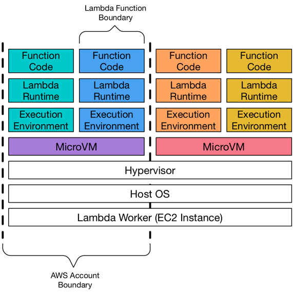
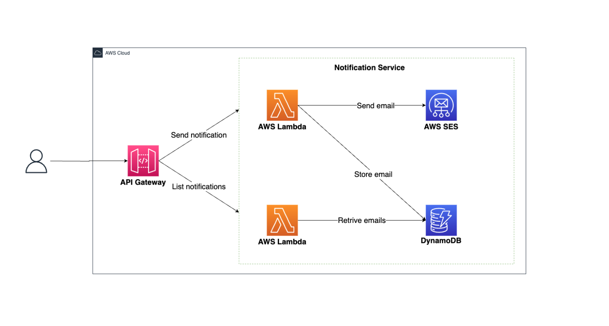

Serverless computing is a cloud computing execution model in which the cloud provider dynamically manages the allocation
of machine resources. Pricing is based on the actual amount of resources consumed by an application, rather than on
pre-purchased units of capacity. It is a form of utility computing.

AWS Lambda is a serverless compute service that was created by Amazon Web Services in 2014.
A key benefit of AWS Lambda is that we don't have to worry about managing and provisioning the infrastructure, which
means that our focus is on developing the business logic.

Key Features:

- No servers to manage
- Continuous scaling
- High availability
- Pay-per-use pricing model

### Use Cases

Here are some of the most common use cases for AWS Lambda:

- Data processing
- Real-time file processing
- REST API backends
- Scheduled tasks
- IoT backends

### How AWS Lambda Works

AWS Lambda is an event-driven service. It executes code in response to events that are generated by other AWS services

This is a typical workflow when a function is invoked by an event source if the environment is not provisioned:

1. The event source invokes the function.
2. AWS Lambda service launches microVM instance
3. An execution environment is created for the function.
4. A language runtime is initialized.
5. The function code is executed.

### AWS Lambda Languages and Runtimes

AWS Lambda supports a wide range of programming languages and runtimes.
Here are some of the most popular ones:

- Java
- Node.js
- Python
- Go
- Ruby
- C#
- PowerShell
- Custom Runtimes (This allows us to use any programming language or runtime)

### Why you should not use AWS Lambda?

Serverless computing is not a silver bullet. It has its own set of drawbacks and limitations.

- Cold start: The first time a function is invoked, it takes longer to execute because the execution environment has to
  be initialized.
- You can't use long-running processes: The maximum execution time is 15 minutes.
- You are not comfortable with public cloud architecture: AWS Lambda is a public cloud service.
- You need more control over the infrastructure: AWS Lambda is a managed service.
- You want to be vendor-agnostic: AWS Lambda is a proprietary service.

### Alternatives to AWS Lambda
AWS Lambda is not the only serverless computing service available on the market.

Here are some of the most popular alternatives:

Cloud-Based Serverless Alternatives:

- Azure Functions
- Google Cloud Functions
- IBM Cloud Functions
- Alibaba Cloud Function Compute
- Oracle Functions

On-Premise Serverless Alternatives:

- OpenFaaS,
- Kubeless
- Knative
- OpenWhisk
- Fission
- Nuclio

The key benefit from my perspective is how quickly you can build applications with Lambda when combined with other AWS service.
It’s not perfect but it’s a great option for many use cases.

I built some POCs with AWS Lambda and I was impressed by how easy it is to get started with it.

## Notifications Service
Notifications Service is a serverless application that sends notifications to users via email.

The application is composed of the following components:
- API Gateway to expose 2 endpoints: one for sending notifications and one for retrieving sent notifications.
- Lambda function to process the requests and send the notifications.
- DynamoDB table to store the notifications.
- Amazon SES to send the emails.

Github Repo: [notification-service](https://github.com/DragomirAlin/serverless/tree/main/aws/invoice-importer)

## Invoice Importer
Invoice Importer is a serverless application that imports invoices from a CSV file into a database.

The application is composed of the following components:
- API Gateway to expose an endpoint for retrieving invoices.
- AWS S3 to store the CSV files and trigger the Lambda function to process them.
- Lambda function to process the CSV files and import the invoices into the database.
- DynamoDB table to store the invoices.

Github Repo: [invoice-importer](https://github.com/DragomirAlin/serverless/tree/main/aws/invoice-importer)

