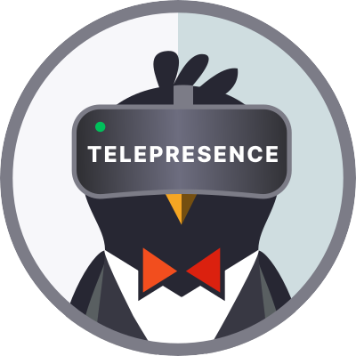
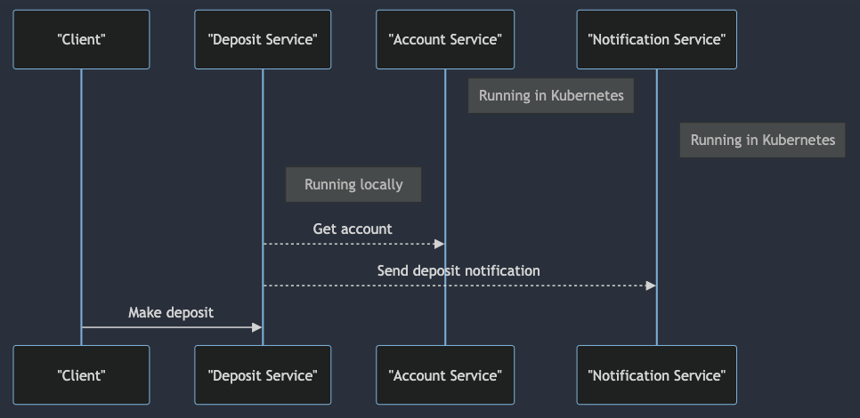
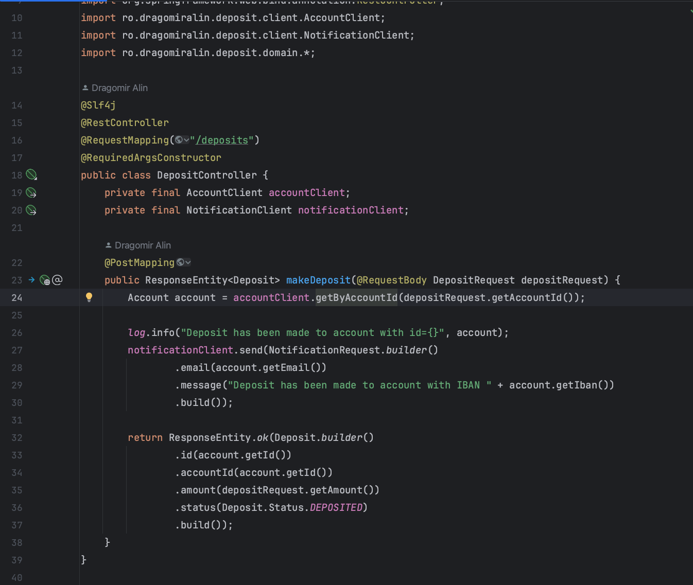
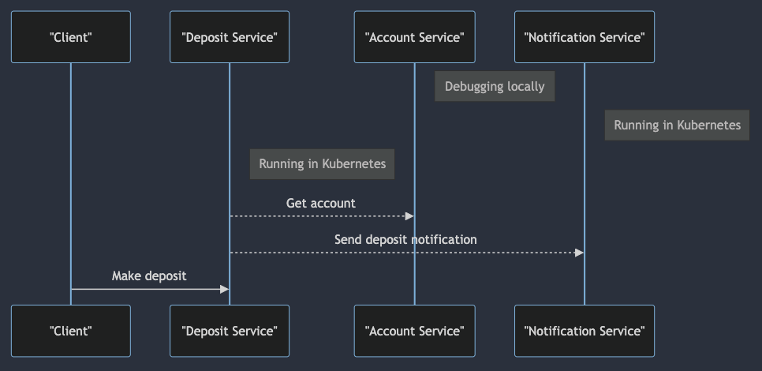
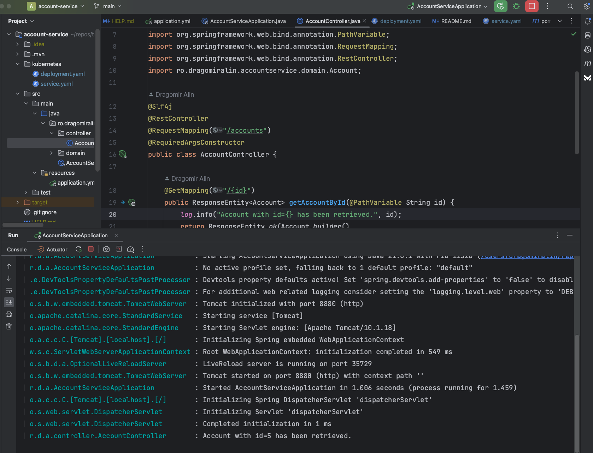

In this article, you will discover another cloud tool to improve your development workflow on Kubernetes: Telepresence.
Telepresence helps us to develop and debug Kubernetes microservices locally and speed up the development workflow.

### 1. What is Telepresence?




Telepresence is an open-source tool that allows us to set up remote development environments on Kubernetes while having
the local development experience.

- Telepresence is a CLI tool that runs on macOS, Linux, and Windows.
- It uses a two-way network proxy to route traffic between a local process and a remote Kubernetes cluster.
- Telepresence is a CNCF project and is maintained by the Ambassador Labs team.

### 2. Prerequisites

- A Kubernetes cluster (Minikube, Docker Desktop, or any other Kubernetes cluster)
- kubectl CLI tool

### 3. Install Telepresence

Let's start by installing Telepresence on our local
machine. [Installation instructions](https://www.telepresence.io/docs/latest/quick-start) are available on the official
website.

```shell
# Intel Macs

# 1. Download the latest binary (~105 MB):
sudo curl -fL https://app.getambassador.io/download/tel2oss/releases/download/v2.17.0/telepresence-darwin-amd64 -o /usr/local/bin/telepresence

# 2. Make the binary executable:
sudo chmod a+x /usr/local/bin/telepresence

# Apple silicon Macs

# 1. Download the latest binary (~101 MB):
sudo curl -fL https://app.getambassador.io/download/tel2oss/releases/download/v2.17.0/telepresence-darwin-arm64 -o /usr/local/bin/telepresence

# 2. Make the binary executable:
sudo chmod a+x /usr/local/bin/telepresence
```

After installing Telepresence CLI, let's install the Telepresence Kubernetes controller on our Kubernetes cluster.

```shell
telepresence helm install
```

Connect Telepresence to the Kubernetes cluster.

```shell
telepresence connect
```

### 4. Deploy microservices

We will deploy three microservices: `account-service`, `deposit-service`, and `notification-service`.
 
- `account-service`: gets the account information
- `deposit-service`: makes a deposit to an account (calls `account-service` to get account and `notification-service` to
notify the customer)
- `notification-service`: sends a notification to the customer

Check the source code on [GitHub](https://github.com/DragomirAlin/tools/tree/main/telepresence/apps)
Each microservice has a `README.md` file with instructions on how to build and deploy the microservice.

After deploying the microservices, we can check if the microservices are running on Kubernetes.

```shell
kubectl get pods
NAME                                    READY   STATUS    RESTARTS   AGE
notification-service-58df65d7b5-d9jpt   1/1     Running   0          5m
account-service-75568f64f8-98qq8        1/1     Running   0          5m
deposit-service-8fddc6b9-b4nwx          1/1     Running   0          5m
```

### 5. Scenario 1: Develop a microservice locally and use other microservices running on Kubernetes

Our microservice needs other microservices to work properly. For example, the deposit-service needs the account-service
and the notification-service to work properly.
Let's develop the deposit-service locally and use the account-service and the notification-service running on
Kubernetes.



Start `deposit-service` locally in our IDE.


Let's check if Telepresence is connected to the Kubernetes cluster.

```shell
telepresence list
account-service     : ready to intercept (traffic-agent not yet installed)
deposit-service     : ready to intercept (traffic-agent not yet installed)
notification-service: ready to intercept (traffic-agent not yet installed)
```

Let's start by intercepting the deposit-service.

```shell
telepresence intercept deposit-service --port 8881:8881
```

Check if the deposit-service is intercepted.

```shell
telepresence list                                            
account-service     : ready to intercept (traffic-agent not yet installed)
deposit-service     : intercepted
   Intercept name         : deposit-service
   State                  : WAITING
   Workload kind          : Deployment
   Destination            : 127.0.0.1:8881
   Service Port Identifier: http
   Intercepting           : all TCP connections
notification-service: ready to intercept (traffic-agent not yet installed)
```

Let's call the deposit-service endpoint to check if it works properly.

```shell
http POST http://localhost:8881/deposits accountId=5 amount=5

{
    "accountId": 5,
    "amount": 5.0,
    "id": 5,
    "status": "DEPOSITED"
}
```

Now, we can start developing our microservice locally. We can use our favorite IDE and debug the code as we would do
with any other local application and notification-service and account-service running on Kubernetes.

Clean up the Telepresence agent.

```shell
telepresence uninstall --agent deposit-service 
```

### 6. Scenario 2: Debugging a microservice running on Kubernetes

We have several microservices running on Kubernetes, we want to debug `account-service` locally. We can use Telepresence
to intercept the microservice and debug it locally.



We will make a request to `deposit-service`(running on kubernetes) and `deposit-service` will call `account-service`. We
want to debug `account-service` locally.

Start `account-service` locally in our IDE.

Let's start by intercepting the `account-service`.

```shell
telepresence intercept account-service --port 8880:8880

Using Deployment account-service
   Intercept name         : account-service
   State                  : ACTIVE
   Workload kind          : Deployment
   Destination            : 127.0.0.1:8880
   Service Port Identifier: http
   Volume Mount Error     : sshfs is not installed on your local machine
   Intercepting           : all TCP connections
```


If you don't have your application exposed externally, you can use the following command to access the deposit-service
API.

```shell
kubectl port-forward svc/deposit-service 8881:8881 
Forwarding from 127.0.0.1:8881 -> 8881
Forwarding from [::1]:8881 -> 8881
Handling connection for 8881
```

Let's call the `deposit-service`(running on kubernetes) endpoint.

```shell
http POST http://localhost:8881/deposits accountId=5 amount=5

{
    "accountId": 5,
    "amount": 5.0,
    "id": 5,
    "status": "DEPOSITED"
}
```

`deposit-service` will call `account-service` and we can debug the code locally.




Clean up the Telepresence agent.

```shell
telepresence uninstall --agent account-service
```

As you can see, Telepresence is a great tool to speed up the development workflow on Kubernetes.


